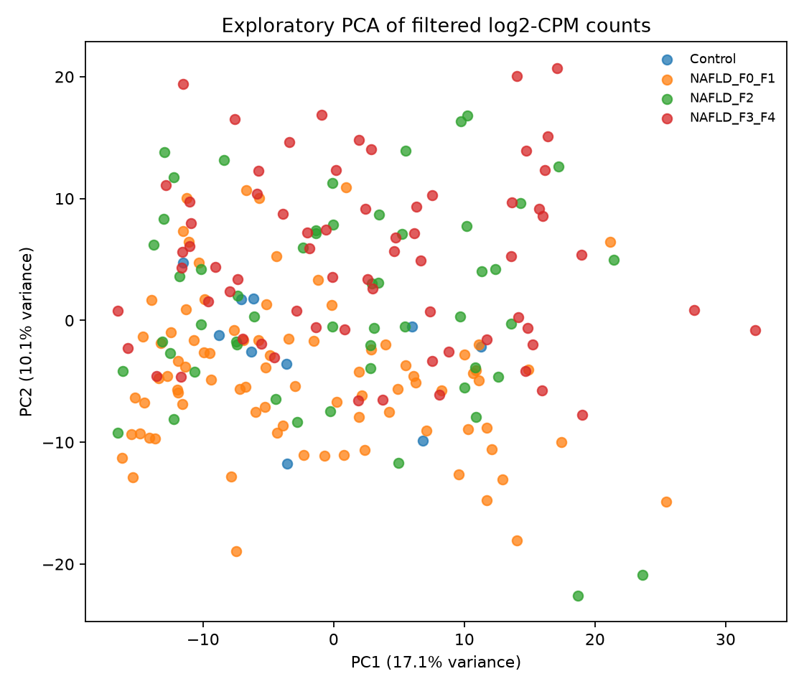
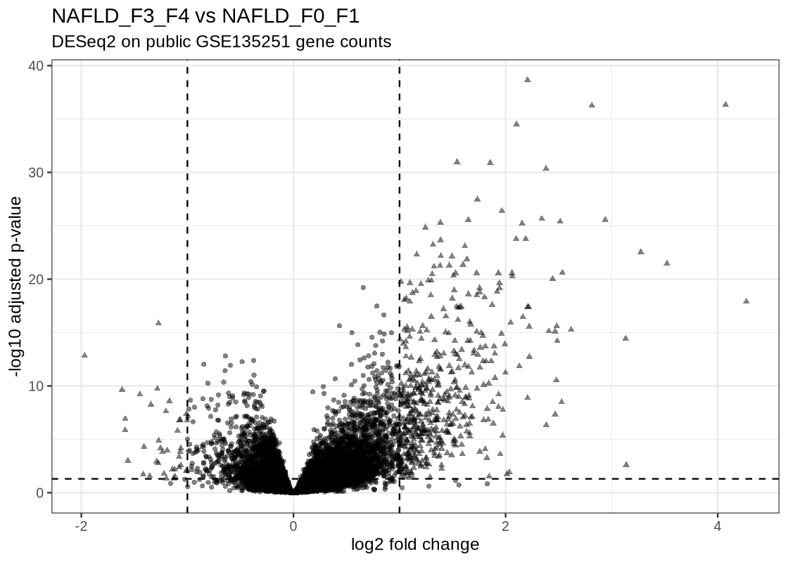
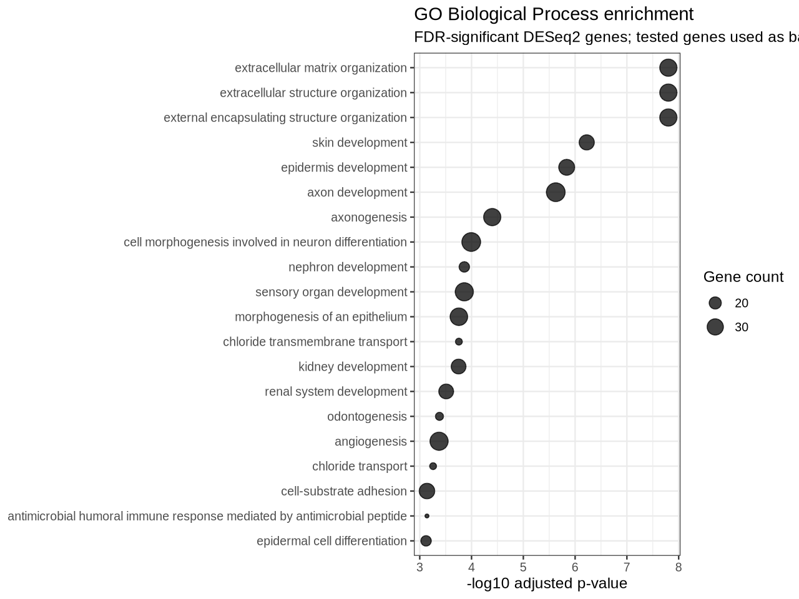

# NAFLD RNA-seq Transcriptomics — GSE135251

Reproducible analysis of **public human liver RNA-seq data** from NCBI GEO accession **GSE135251**, focused on transcriptomic changes across NAFLD fibrosis severity.

## Why this project

This repository is the real-public-data component of my bioinformatics portfolio. It demonstrates how I move from a published GEO accession to validated sample metadata, a gene-count matrix, RNA-seq QC, count-aware differential expression, FDR-controlled results, pathway analysis, figures, tests, CI, and a reproducible workflow.

## Dataset

NCBI GEO describes GSE135251 as a multicenter human liver transcriptomics study containing **216 snap-frozen liver biopsies: 206 NAFLD cases spanning different fibrosis stages and 10 controls**. Samples were sequenced on the Illumina NextSeq 500 platform.

The public processed files are gene-level count tables. GEO sample records report that reads were cropped to 75 bp with Trimmomatic, aligned to **GRCh38 / Ensembl release 78** with STAR, and quantified with **HTSeq-count** using reverse-stranded counting.

- GEO: https://www.ncbi.nlm.nih.gov/geo/query/acc.cgi?acc=GSE135251
- BioProject: PRJNA558102
- SRA: SRP217231

## Biological question

**How does the liver transcriptome change as fibrosis severity increases across NAFLD?**

The primary differential-expression contrast is:

**NAFLD fibrosis F3–F4 vs NAFLD fibrosis F0–F1**

Controls and F2 samples are retained in the parsed metadata and can be used for additional comparisons. The repository preserves the original GEO fields and derives a separate `analysis_group` only for transparent downstream grouping.

## Verified public-data results

The full versioned workflow was executed against the public GEO processed counts in GitHub Actions and completed successfully.

### Cohort and QC audit

- **216 samples** were recovered and matched between the count matrix and parsed metadata.
- The cohort contains **206 NAFLD samples and 10 controls**.
- Derived analysis groups contain **85 F0–F1**, **53 F2**, **68 F3–F4**, and **10 control** samples.
- The count matrix contains **64,253 raw gene rows**; **18,360 genes** passed the exploratory QC expression filter.
- Median library size was approximately **24.3 million counts**.
- In the exploratory PCA, PC1 and PC2 explained approximately **17.1%** and **10.1%** of variance, respectively.



*Exploratory PCA uses filtered log2-CPM values only; inferential differential expression uses raw integer counts.*

### Differential expression

The DESeq2 F3–F4 vs F0–F1 contrast used **153 NAFLD samples**. After the DESeq2 expression filter, **17,973 genes** were tested and **551 genes** met both **Benjamini-Hochberg FDR < 0.05** and **|log2 fold change| ≥ 1**.



A lightweight ranked result snapshot is committed under `results/snapshot/`; the full result table and normalized count matrix remain reproducible outputs rather than versioned large intermediates.

### GO Biological Process enrichment

Of the 551 significant Ensembl genes, **504 mapped to Entrez IDs**, and the enrichment analysis returned **247 GO Biological Process terms at FDR < 0.05**.

The strongest enrichment signal was centered on **extracellular matrix / extracellular structure organization**. The leading `extracellular matrix organization` term showed approximately **4-fold enrichment** with an adjusted p-value of approximately **1.6 × 10⁻8** and included genes such as **FAP, COL1A1, COL1A2, MMP2, and TGFB2**. These results are consistent with a fibrosis-associated remodeling signal in the advanced-fibrosis group, while remaining an observational transcriptomic comparison rather than a causal claim.



## Workflow

```text
GEO GSE135251
   │
   ├── GSE135251_RAW.tar ──> 216 HTSeq gene-count files
   │                              │
   │                              └──> validated gene × sample count matrix
   │
   └── GSE135251_family.soft.gz ──> parsed sample metadata
                                      │
                                      ├── disease / NAS / fibrosis stage
                                      └── derived fibrosis analysis group

count matrix + metadata
   │
   ├── dataset audit
   │   ├── expected 216-sample check
   │   ├── count/metadata sample consistency
   │   └── disease and fibrosis-group summaries
   │
   ├── exploratory QC
   │   ├── library-size diagnostics
   │   ├── expression filtering
   │   └── PCA on filtered log2-CPM values
   │
   └── DESeq2 on raw integer counts
       ├── F3–F4 vs F0–F1
       ├── Benjamini-Hochberg FDR
       ├── normalized counts
       ├── volcano plot
       └── GO Biological Process enrichment
```

### Important statistical boundary

The log2-CPM transform is used **only for exploratory QC/PCA**. Differential expression is performed on the original integer counts with **DESeq2**, so the inferential analysis remains count-aware.

GO enrichment is downstream of the DESeq2 FDR-filtered gene set. Ensembl gene IDs are mapped to Entrez IDs with `org.Hs.eg.db`, and the tested DESeq2 genes are used as the enrichment background rather than the whole genome.

## Repository structure

```text
nafld-rnaseq-transcriptomics/
├── .github/workflows/
│   ├── ci.yml
│   └── public-data-analysis.yml
├── data/
│   └── README.md
├── metadata/
│   └── README.md
├── scripts/
│   ├── download_geo.py
│   ├── parse_geo_soft.py
│   ├── build_count_matrix.py
│   ├── audit_dataset.py
│   ├── qc_counts.py
│   ├── differential_expression.R
│   └── pathway_enrichment.R
├── results/snapshot/
├── figures/snapshot/
├── tests/
│   ├── test_parse_geo_soft.py
│   ├── test_build_count_matrix.py
│   ├── test_audit_dataset.py
│   └── test_qc_counts.py
├── workflow/Snakefile
├── environment.yml
├── requirements-dev.txt
├── CITATION.cff
├── LICENSE
└── README.md
```

## Reproduce the analysis

Create the full Conda environment:

```bash
conda env create -f environment.yml
conda activate nafld-rnaseq
```

Run the complete workflow:

```bash
snakemake --snakefile workflow/Snakefile --cores 4
```

The workflow downloads the public GEO inputs automatically, builds the count matrix and metadata, validates the complete dataset, generates QC outputs, runs the default DESeq2 fibrosis contrast, and performs GO Biological Process enrichment.

### Run preprocessing tests only

```bash
python -m pip install -r requirements-dev.txt
pytest -q
```

GitHub Actions runs the Python tests, compiles the scripts, and validates the Snakemake DAG on every pull request and push to `main`. A separate reproducible analysis workflow records the successful full public-data run and commits only a lightweight reviewed results snapshot.

## Committed results snapshot

`results/snapshot/` contains small, recruiter-reviewable outputs from the successful public-data run, including:

- dataset and analysis-group audit summaries;
- QC summary metrics;
- DESeq2 run summary;
- top-ranked DESeq2 results;
- GO enrichment summary and top terms.

`figures/snapshot/` contains the selected PCA, library-size, volcano, and GO enrichment figures.

Large upstream downloads, the full gene × sample count matrix, the normalized count matrix, and large intermediate result tables remain excluded from Git because they are reproducible from the public accession and workflow.

## Data handling and reproducibility

This repository begins from the **GEO-provided processed gene counts**, not from raw SRA FASTQ re-alignment. That boundary is explicit: upstream Trimmomatic/STAR/HTSeq processing is provenance reported by GEO, not code reproduced in this repository.

## Interpretation policy

Only results produced by the versioned workflow from the public GSE135251 data are described as findings here. The analysis demonstrates association with fibrosis severity; it does not establish causal mechanisms or clinical utility.

## Author

Hemalatha Ponnam  
M.S. Bioinformatics & Computational Biology  
Bioinformatics & Research Computing
